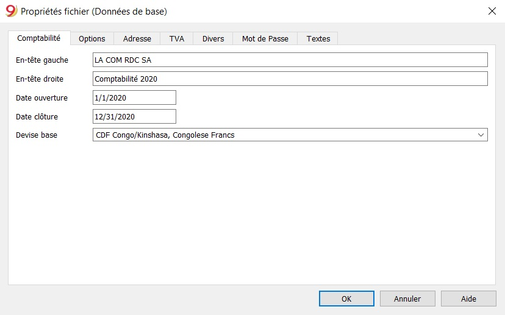
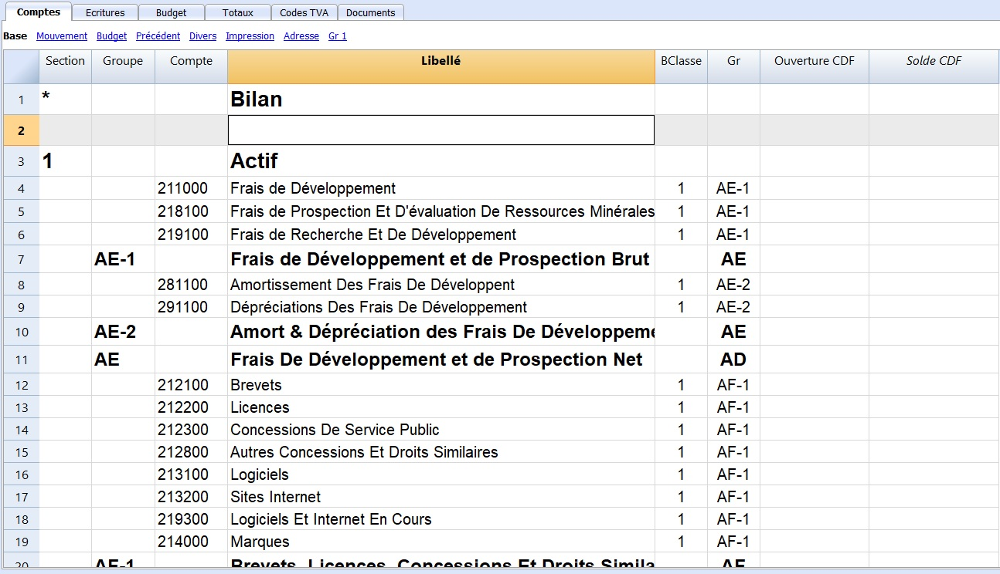
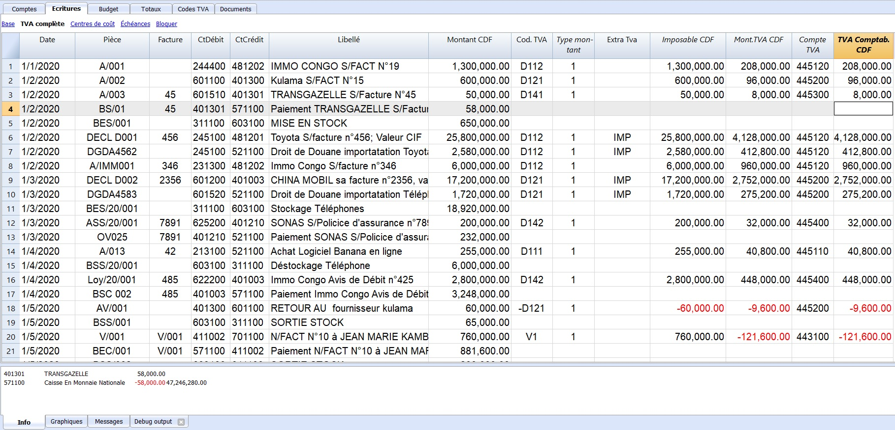
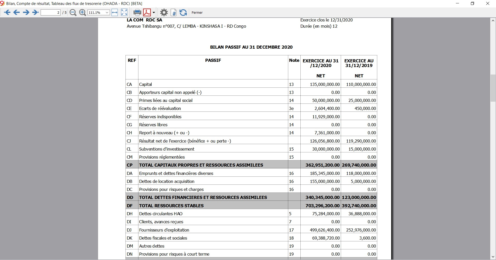
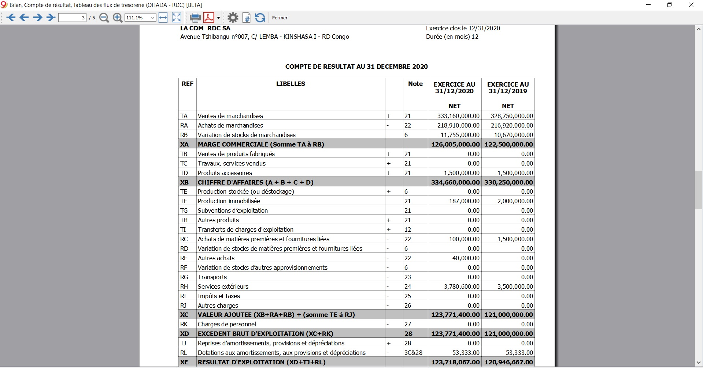

## Comment utiliser l'extension Rapports Comptables OHADA - RDC ?

### 1. Introduction

Cette extension permet de générer en quelques clics, les rapports suivants selon le modèle OHADA: 

- Bilan actif/passif

- Compte de résultat

- Tableau des flux de trésorerie

### 2. Prérequis

Pour obtenir le résultat escompté, il est préférable de télécharger un des modèles, selon que vous vouliez faire la comptabilité mono ou multidevise et avec ou sans TVA, à partir du lien ci-après. https://www.banana.ch/apps/fr?combine=&langcode=All&country=307

Après avoir ouvert un des modèles préconfigurés, il faudrait généralement l’adapter en modifiant : les propriétés du fichier (en-tête ainsi que la période comptable et l’adresse) puis procéder avec l’adaptation du plan des comptes en insérant vos propres comptes bancaires, insérer ou modifier vos comptes selon vos exigences. Ceci peut aussi être fait par la suite, selon les besoins qui se présentent.

### 3. Utilisation

#### Propriétés fichier (Données de base)

Configurer les propriétés du fichier (données de base):

- Du menu Fichier, commande **Propriétés Fichier (Données de base)**, indiquez le nom de l'entreprise qui apparaîtra sur les rapports imprimés et sur d'autres données.

- Sélectionnez la devise de base pour la gestion de la comptabilité.

#### Le plan des comptes

Le plan des comptes figure dans le tableau **Comptes** où l'on définit les comptes et les groupes dans lesquels les comptes devront être totalisés. 
Notez que pour les fichiers modèles (.ac2) téléchargés, on peut créer des nouveaux comptes selon les besoins, mais il n'est pas envisageable de supprimer ou modifier les groupes existants.
Pour plus de détails sur la configuration du plan comptable, référez-vous à la documentation sur le logiciel Banana concernant le sujet. https://www.banana.ch/doc9/fr/node/3826

En ce qui concerne la configuration du plan de comptes OHADA, nous nous sommes référés aux structures des tableaux de correspondance postes/comptes, le plan de comptes OHADA, le plan de comptes général OHADA ainsi qu’aux modèles des Etats financiers (bilan, compte de résultats, tableau de flux de trésorerie). 
Pour plus de détails sur la configuration du plan comptable OHADA, référez-vous à la documentation de Banana Education concernant le sujet. https://github.com/BananaEducation/CongoRDC/blob/master/manuel_d_utilisation/Activity2.md

#### Soldes d'ouverture

Quand on utilise Banana Comptabilité pour la première fois, il est nécessaire d'insérer les soldes initiales manuellement pour créer le bilan d'ouverture.

La documentation Banana donne plus de détails sur les soldes d'ouverture, les différences soldes d'ouverture et soldes de l'année précédente. 

Lien vers la documentation: https://www.banana.ch/doc9/fr/node/2626

#### Écritures

Les écritures doivent être insérées dans le tableau **Écritures**.

a. **Date :** La date doit être située dans la période comptable définie dans les données de base de la comptabilité. Dans les options on peut indiquer que la date est obligatoire, autrement la valeur peut être vide. S'il y a des écritures bloquées, le programme signale une erreur quand on insère une date inférieure ou égale à la date du bloc.

b. **Pièce :** Le numéro du justificatif qui est la base pour l'écriture comptable. En introduisant les écritures, il est conseillé d'indiquer un numéro progressif sur le document, de façon à ce que l'on peut facilement retrouver la pièce comptable. La fonction de saisie semi-automatique suggère des valeurs progressives et des codes d'écriture définis précédemment dans le tableau Écritures répétées. Le programme propose le numéro suivant du document, qui peut être repris avec la touche **F6**.

- Numérotation numérique, le programme incrémente simplement la valeur plus élevée trouvée dans la **colonne Doc ;**

- Numérotation alphanumérique, le programme incrémente la partie numérique finale ; cette fonction est utile si l'on veut tenir des numérotations séparées pour la caisse ou la banque.

    -   Si précédemment C-01a été inséré, et on commence à taper C, le
        programme propose C-02.

    -   Si précédemment B104 a été inséré, et on commence à taper B, le
        programme propose B105.

    -   Si précédemment D10-04 a été inséré, et on commence à taper D,
        le programme propose D10-05.

Dans les écritures répétées vous pouvez prédisposer des groupes d'écritures qui seront reprises au moyen d'un code.

Pour ajouter une grande quantité de numéros, vous pouvez éventuellement
profiter d'Excel. Créez dans Excel la quantité désirée de numéros de
pièces et copier et coller dans la colonne **Pièce** du tableau Ecritures de Banana Comptabilité.

c. **Facture :** Un numéro de facture émise ou payée qui est utilisé avec la fonction de contrôle-factures pour clients et fournisseurs.

d. **Compte Débit :** Le compte qui sera débité.

e. **Compte Crédit :** Le compte qui sera crédité.

f. **Libellé :** Le texte de l'écriture. La fonction de saisie semi-automatique suggère le texte d'une écriture déjà insérée, ou insérée l'année précédente si l'option appropriée est active. En pressant la touche **F6**, le programme reprend les données de la ligne précédente avec le même libellé et complète les champs de la ligne actuelle.

g. **Montant :** Le montant qui sera inséré sur le compte Débit et le compte Crédit.

*Colonnes TVA*

h. **Cod. TVA :** Le code d'activation de la taxe sur la valeur ajoutée. Il y a un code TVA approprié pour chaque type d'écriture et la TVA est comptabilisée automatiquement pour chaque activation.

i. **Type montant :** C'est un code qui indique comment sera considéré le montant de l'écriture.
    
- 0 Lorsque c'est zéro, la cellule reste vide : la TVA est incluse dans le montant de l'écriture ;

- 1 = hors TVA, la TVA n'est pas incluse dans le montant de l'écriture. (Cas de la RDC)

- 2 = Montant TVA le montant de l'écriture est considéré comme
    montant TVA à 100%

j. **Extra TVA :** Un code relatif aux informations supplémentaires de la TVA, à utiliser dans des cas très particuliers. On peut insérer un sigle pour identifier différents cas de TVA (IMP=Importation)

k. **Montant TVA :** Le montant TVA est automatiquement indiqué par le programme.

l. **Imposable :** Une fois que le code TVA est inséré, le programme indique automatiquement le montant imposable (hors TVA)

m. **Compte TVA :** Ici est indiqué, automatiquement, le compte sur lequel la TVA est enregistrée (pour la RDC les comptes 443… sont utilisés pour la TVA collectée et les comptes 445… sont utilisés pour la TVA déductible ou récupérable et lors de la régularisation de la TVA, les comptes 443… sont virés au crédit des comptes 4441 et 445… sont crédités par le débit du compte 4441 TVA due).

n. **TVA Comptabilisée :** le montant enregistré dans le compte TVA est calculé par le programme sur la base du montant de l'écriture, le type du montant et le pourcentage de la TVA.

Pour plus de détails sur les différents types d'écritures, les écritures répétées, les colonnes, etc... il suffit de consulter la documentation Banana Comptabilité sur les écritures.

https://www.banana.ch/doc9/fr/node/2630

#### Rapports Comptables

Les rapports comptables concernés sont:

- Le bilan

- Le compte de résultat

- Le tableau des flux de trésorerie

##### 1. BILAN

##### 2. COMPTE DE RÉSULTAT

##### 3. TABLEAU DES FLUX DE TRÉSORERIE

Pour comprendre les différentes lignes du tableau des flux de trésorerie, référez-vous à la documentation de Banana Education en cliquant sur ce lien. https://github.com/BananaEducation/CongoRDC/blob/master/manuel_d_utilisation/Activity8.md

