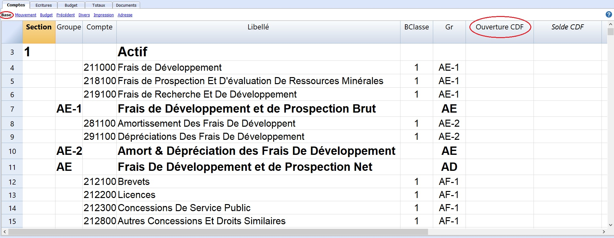

## Comment utiliser l'extension Rapports Comptables OHADA - RDC ?

### 1. Introduction

Cette extension permet de générer en quelques clics, les rapports suivants selon le modèle OHADA: 

- Bilan actif/passif

- Compte de résultat

- Tableau des flux de trésorerie

### 2. Prérequis

Pour obtenir le résultat escompté, il est préférable de télécharger un des modèles, selon que vous vouliez faire la comptabilité mono ou multidevise et avec ou sans TVA, à partir du lien ci-après. https://www.banana.ch/apps/fr?combine=&langcode=All&country=307

Après avoir ouvert un des modèles préconfigurés, il faudrait généralement l’adapter en modifiant : les propriétés du fichier (en-tête ainsi que la période comptable et l’adresse) puis procéder avec l’adaptation du plan des comptes en insérant vos propres comptes bancaires, insérer ou modifier vos comptes selon vos exigences. Ceci peut aussi être fait par la suite, selon les besoins qui se présentent.

### 3. Utilisation

#### Propriétés fichier (Données de base)

Configurer les propriétés du fichier (données de base):

- Du menu Fichier, commande **Propriétés Fichier (Données de base)**, indiquez le nom de l'entreprise qui apparaîtra sur les rapports imprimés et sur d'autres données.

- Sélectionnez la devise de base pour la gestion de la comptabilité.

#### Le plan des comptes

Le plan des comptes figure dans le tableau **Comptes** où l'on définit les comptes et les groupes dans lesquels les comptes devront être totalisés. 
Notez que pour les fichiers modèles (.ac2) téléchargés, on peut créer des nouveaux comptes selon les besoins, mais il n'est pas envisageable de supprimer ou modifier les groupes existants.
Pour plus de détails sur la configuration du plan comptable, référez-vous à la documentation sur le logiciel Banana concernant le sujet. https://www.banana.ch/doc9/fr/node/3826

En ce qui concerne la configuration du plan de comptes OHADA, nous nous sommes référés aux structures des tableaux de correspondance postes/comptes, le plan de comptes OHADA, le plan de comptes général OHADA ainsi qu’aux modèles des Etats financiers (bilan, compte de résultats, tableau de flux de trésorerie). 
Pour plus de détails sur la configuration du plan comptable OHADA, référez-vous à la documentation de Banana Education concernant le sujet. https://github.com/BananaEducation/CongoRDC/blob/master/manuel_d_utilisation/Activity2.md

#### Soldes d'ouverture

Quand on utilise Banana Comptabilité pour la première fois, il est nécessaire d'insérer les soldes initiales manuellement pour créer le bilan d'ouverture.

La documentation Banana donne plus de détails sur les soldes d'ouverture, les différences soldes d'ouverture et soldes de l'année précédente. 

Lien vers la documentation: https://www.banana.ch/doc9/fr/node/2626

#### Écritures

Les écritures doivent être insérées dans le tableau **Écritures**.

Pour plus de détails sur les différents types d'écritures, les écritures répétées, les colonnes, etc... il suffit de consulter la documentation Banana Comptabilité sur les écritures.

https://www.banana.ch/doc9/fr/node/2630

#### Rapports Comptables

##### 1. BILAN

